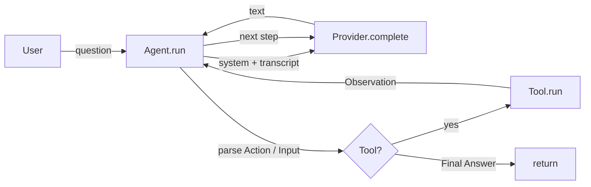

<p align="center">
  
  
  
  
  
</p>

<h1 align="center">🌱 miniagent</h1>

<p align="center">
  <b>Build LLM agents with tools + memory in a few hundred lines of pure Python.</b><br/>
  No LangChain, no AutoGen, no bloat — just the ReAct loop and the pieces you actually need.
</p>

---

## Why miniagent?

Frameworks like LangChain are powerful but heavy. When you *want to understand* how an
agent works — or ship something small and auditable — you don't need 200 abstractions.
You need:

1. a way to **call a model**,
2. a way to **let it use tools**, and
3. a **loop** that ties thought → action → observation together.

`miniagent` is exactly that, in ~400 lines of readable, dependency-free Python.
Great for learning, prototyping, and embedding agents in your own projects.

### Features

- 🧠 **ReAct loop** — reason, act, observe, repeat (until a `Final Answer`).
- 🛠️ **Tool calling** — decorate any function with `@tool`; its name + docstring are
  auto-exposed to the model.
- 💾 **Memory** — the full transcript is fed back each step so the model reasons over
  what it already did.
- 🔌 **Pluggable providers** — `Mock` (offline), `OpenAI`, `Anthropic`, `Ollama`.
  Core is **pure stdlib**; `requests` is only needed for HTTP backends.
- ✅ **Tested offline** — ships with unit tests that run with zero API keys.

---

## Install

```bash
pip install requests        # only needed for OpenAI / Anthropic / Ollama
# or just clone it — the core needs nothing:
git clone https://github.com/qi-fg/miniagent && cd miniagent
```

---

## Quickstart

```python
from miniagent import Agent, MockProvider, ToolRegistry, tool

@tool
def calculator(expr: str) -> float:
    """Evaluate a basic arithmetic expression."""
    import ast, operator
    ops = {ast.Add: operator.add, ast.Sub: operator.sub, ast.Mult: operator.mul,
           ast.Div: operator.truediv, ast.Pow: operator.pow, ast.Mod: operator.mod,
           ast.BitXor: operator.pow, ast.FloorDiv: operator.floordiv,
           ast.USub: operator.neg, ast.UAdd: operator.pos}
    def ev(n):
        if isinstance(n, ast.Expression): return ev(n.body)
        if isinstance(n, ast.Constant) and isinstance(n.value, (int, float)): return n.value
        if isinstance(n, ast.BinOp): return ops[type(n.op)](ev(n.left), ev(n.right))
        if isinstance(n, ast.UnaryOp): return ops[type(n.op)](ev(n.operand))
        raise ValueError("unsupported")
    return ev(ast.parse(expr, mode="eval"))

agent = Agent(MockProvider(), tools=ToolRegistry([calculator]))
print(agent.run("Calculate 123 * 456"))
# -> The result is 56088.
```

Swap `MockProvider` for a real backend in one line:

```python
from miniagent import OpenAIProvider
agent = Agent(OpenAIProvider(model="gpt-4o-mini"), tools=ToolRegistry([calculator]))
```

---

## Architecture



```
┌─────────────────────────────────────────────┐
│                   Agent                      │
│   for step in range(max_steps):              │
│     text = provider.complete(system, mem)    │
│     if "Final Answer:" in text: return       │
│     action, inp = parse(text)                │
│     obs  = tools.run(action, inp)             │
│     mem.add("system", f"Observation: {obs}") │
└─────────────────────────────────────────────┘
        │                      │
   ┌────▼─────┐          ┌─────▼──────┐
   │ Provider │          │ ToolRegistry│
   │ Mock/    │          │ @tool funcs │
   │ OpenAI/  │          └─────────────┘
   │ Anthropic│
   │ Ollama   │
   └──────────┘
```

---

## How it works (ReAct)

The model is instructed to reply in one of two formats:

```
Final Answer: <your answer>

# or

Thought: <reasoning>
Action: <tool_name>
Action Input: <input>
```

After an `Action`, `miniagent` executes the tool and appends an `Observation`
back into memory. The model sees the observation on the next step and continues
— exactly the classic Reason + Act loop, with no hidden machinery.

### Real output (offline `MockProvider`)

```
🗣  User: Calculate 123 * 456 for me

── transcript ──
👤 Calculate 123 * 456 for me
🤖 Thought: I need to evaluate the arithmetic expression.
Action: calculator
Action Input: 123 * 456
🔧 Observation: 56088
🤖 The result is 56088.

✅ Final answer: The result is 56088.
```

---

## Providers

| Provider | Needs | Notes |
|----------|-------|-------|
| `MockProvider` | nothing | Deterministic offline stub for demos & tests |
| `OpenAIProvider` | `OPENAI_API_KEY` | Chat Completions API (`gpt-4o-mini`, `gpt-4o`, `o3`, …) |
| `AnthropicProvider` | `ANTHROPIC_API_KEY` | Messages API (`claude-3-5-sonnet`, `claude-opus-4`, …) |
| `OllamaProvider` | local Ollama | `http://localhost:11434`, no API key |

---

## Project layout

```
miniagent/
├── miniagent/
│   ├── __init__.py      # public API
│   ├── agent.py         # the ReAct loop
│   ├── tools.py         # @tool decorator + ToolRegistry
│   ├── memory.py        # transcript store
│   ├── providers.py     # Mock / OpenAI / Anthropic / Ollama
│   └── cli.py           # `python -m miniagent.cli`
├── examples/
│   ├── basic.py         # offline demo (calculator + search)
│   ├── custom_tool.py   # how to add your own tool
│   └── real_agent.py    # chat loop for real providers (OpenAI/Anthropic/Ollama)
├── tools/
│   └── generate_social_preview.py  # renders assets/social-preview.png
└── tests/
    └── test_agent.py    # offline unit tests
```

---

## Adding your own tool

```python
@tool
def weather(city: str) -> str:
    """Return the current weather for a city, e.g. 'Zhengzhou'."""
    return f"{city}: 26C, partly cloudy"

agent = Agent(MockProvider(), tools=ToolRegistry([weather, calculator]))
agent.run("What is the weather in Zhengzhou?")
```

That's it — the docstring becomes the tool description the model sees.

---

## CLI

```bash
python -m miniagent.cli "Calculate 123 * 456" --provider mock
python -m miniagent.cli --provider ollama --model llama3.1 --interactive
```

---

## Testing

```bash
python -m unittest tests/test_agent.py   # no API key required
```

---

## Roadmap

- [ ] Native function-calling mode for OpenAI/Anthropic
- [ ] Async provider support
- [ ] Streaming responses
- [ ] Retrieval (RAG) memory backend

---

## License

[MIT](LICENSE) © Li Yongqi
